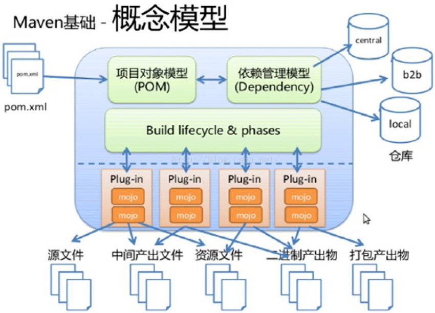

## Maven生命周期

- CleanLifecycle：在构建之前完成清理
- DefaulLifecycle：构建核心部分，包括：编译，测试，打包，部署等
- SiteLifecycle：生成项目报告，站点，发布站点

注意：不同的生命周期是相互独立的。可以独立完成。


### CleanLifecycle生命周期

#### clean生命周期的各个阶段：

| **Clean生命周期** |                                       |
| ----------------- | ------------------------------------- |
| **pre-clean**     | 执行一些需要在clean之前完成的工作     |
| **clean**         | 移除所有上一次构建生成的文件          |
| **post-clean**    | 执行一些需要在clean之后立刻完成的工作 |

#### 命令：

- mvn pre-clean
- mvn clean
- mvn post-clean

注意：生命周期后一个阶段包含了前面所有的阶段，即执行`mvn post-clean`时，`mvn pre-clean` ，`mvn clean` 都会被执行，等同于 `mvn pre-clean clean post clean`,用以简化命令行的输入。

### DefaulLifecycle生命周期

#### default生命周期的各个阶段


| default生命周期         |                                                              |
| ----------------------- | ------------------------------------------------------------ |
| validate                | 验证项目是否正确，以及所有为了完整构建必要的信息是否可用     |
| generate-sources        | 生成所有需要包含在编译过程中的源代码                         |
| process-sources         | 处理源代码，比如过滤一些值                                   |
| generate-resources      | 生成所有需要包含在打包过程中的资源文件                       |
| process-resources       | 复制并处理资源文件至目标目录，准备打包                       |
| compile                 | 编译项目的源代码                                             |
| process-classes         | 处理编译生成的文件，例如对Java类进行字节码增强（bytecode enhancement） |
| generate-test-sources   | 生成所有包含在测试编译过程中的测试源码                       |
| process-test-sources    | 处理测试源码，比如过滤一些值                                 |
| generate-test-resources | 生成测试需要的资源文件                                       |
| process-test-resources  | 复制并处理测试资源文件至测试目标目录                         |
| test-compile            | 编译测试源码至测试目标目录                                   |
| test                    | 使用合适的单元测试框架运行测试。这些测试应该不需要代码被打包或发布 |
| prepare-package         | 在真正的打包之前，执行一些准备打包必要的操作                 |
| package                 | 将编译好的代码打包成可分发的格式，如JAR，WAR，或者EAR        |
| pre-integration-test    | 执行一些在集成测试运行之前需要的动作。如建立集成测试需要的环境 |
| integration-test        | 如果有必要的话，处理包并发布至集成测试可以运行的环境         |
| post-integration-test   | 执行一些在集成测试运行之后需要的动作。如清理集成测试环境。   |
| verify                  | 执行所有检查，验证包是有效的，符合质量规范                   |
| install                 | 安装包至本地仓库，以备本地的其它项目作为依赖使用             |
| deploy                  | 复制最终的包至远程仓库，共享给其它开发人员和项目（通常和一次正式的发布相关） |

类似于clean生命周期，后面的命令也包含前面的操作，但是可以通过一些方式跳过某些阶段，如：跳过测试阶段（mvn install -DskipTest）

### site生命周期

#### site生命周期的各个阶段

| **Site生命周期** |                                                            |
| ---------------- | ---------------------------------------------------------- |
| **pre-site**     | 执行一些需要在生成站点文档之前完成的工作                   |
| **site**         | 生成项目的站点文档                                         |
| **post-site**    | 执行一些需要在生成站点文档之后完成的工作，并且为部署做准备 |
| **site-deploy**  | 将生成的站点文档部署到特定的服务器上                       |

## Maven插件



maven中能够执行的所有命令都是由插件完成的，maven本质上是一个插件框架。

maven官方提供的插件列表

- http://maven.apache.org/plugins/index.html

执行maven插件的语法：

```maven
mvn [plugin-name]:[goal-name]
例：
mvn compiler:compile
```

maven提供的两种插件类型

- 构建插件：在生成过程中执行，并应在pom.xml中的<build/>元素进行配置
- 报告插件：在网站生成期间执行的，应该在pom.xml中的<reporting/>元素进行配置

## Maven命令

### maven命令的两种格式

- `mvn [plugin-name]:[goal-name]`：指定执行的插件及插件目标
- `mvn [lifecycle]`:将插件目标与生命周期绑定

### 常用的maven命令

| Maven常用命令列表          |                                                              |
| -------------------------- | ------------------------------------------------------------ |
| **mvn –version**           | 显示版本信息                                                 |
| **mvn clean**              | 清理项目生产的临时文件,一般是模块下的target目录              |
| **mvn compile**            | 编译源代码，一般编译模块下的src/main/java目录                |
| **mvn package**            | 项目打包工具,会在模块下的target目录生成jar或war等文件        |
| **mvn test**               | 测试命令,或执行src/test/java/下junit的测试用例               |
| **mvn install**            | 将打包的jar/war文件复制到你的本地仓库中,供其他模块使用       |
| **mvn deploy**             | 将打包的文件发布到远程参考,提供其他人员进行下载依赖          |
| **mvn site**               | 生成项目相关信息的网站                                       |
| **mvn eclipse:eclipse**    | 将项目转化为Eclipse项目                                      |
| **mvn dependency:tree**    | 打印出项目的整个依赖树                                       |
| **mvn archetype:generate** | 创建Maven的普通java项目                                      |
| **mvn tomcat:run**         | 在tomcat容器中运行web应用                                    |
| **mvn jetty:run**          | 调用 Jetty 插件的 Run 目标在 Jetty Servlet 容器中启动 web 应用 |

**注意：**运行maven命令的时候，首先需要定位到maven项目的目录，也就是项目的pom.xml文件所在的目录。否则，必以通过参数来指定项目的目录。

### 命令行参数

| 命令行参数 |                                                              |
| ---------- | ------------------------------------------------------------ |
| **-D**     | 传入属性参数，如`mvn package -Dmaven.test.skip=true`，跳过单元测试打包 |
| **-P**     | 使用指定的Profile配置                                        |
| **-e **    | 显示maven运行出错的信息                                      |
| **-o**     | 离线执行命令,即不去远程仓库更新包                            |
| **-X**     | 显示maven允许的debug信息                                     |
| **-U**     | 强制去远程更新snapshot的插件或依赖，默认每天只更新一次       |

## Maven仓库

### maven用户拉取依赖流程图


**注意:**虚线为可以没有的仓库。首先会从本地仓库获取，如果本地没有的Maven回去远程仓库中获取依赖。

### maven仓库的种类

- 本地仓库
- 远程仓库
  - 中央仓库
  - 镜像仓库
  - 私服

#### 国内知名的镜像仓库

- 阿里Maven镜像库
- 华为Maven镜像库

#### 主流的私服

- Archiva（Apache）
- Artifactory（JFrog）
- Nexus（Sonatype）

## Maven项目结构

- src
  - main
    - java 	                     具体源码目录
    - resource                     具体项目资源目录 
  - test
    - java                             测试源码目录
    - resource                     测试资源目录
- pom.xml

## Maven版本管理

- SNAPSHOT：频繁发布的版本，发布时会带上时间，可以重复发布为一个版本号。
- LATEST：最新发布的版本。
- RELEASE：稳定版本，同一个版本号的稳定版只能发布一次。

## Maven依赖关系

- 依赖
- 继承
- 聚合

Maven可继承的POM 元素列表如下：

groupId ：项目组 ID ，项目坐标的核心元素；

version ：项目版本，项目坐标的核心元素；

description ：项目的描述信息；

organization ：项目的组织信息；

inceptionYear ：项目的创始年份；

url ：项目的 url 地址

develoers ：项目的开发者信息；

contributors ：项目的贡献者信息；

distributionManagerment：项目的部署信息；

issueManagement ：缺陷跟踪系统信息；

ciManagement ：项目的持续继承信息；

scm ：项目的版本控制信息；

mailingListserv ：项目的邮件列表信息；

properties ：自定义的 Maven 属性；

dependencies ：项目的依赖配置；

dependencyManagement：醒目的依赖管理配置；

repositories ：项目的仓库配置；

build ：包括项目的源码目录配置、输出目录配置、插件配置、插件管理配置等；

reporting ：包括项目的报告输出目录配置、报告插件配置等。

