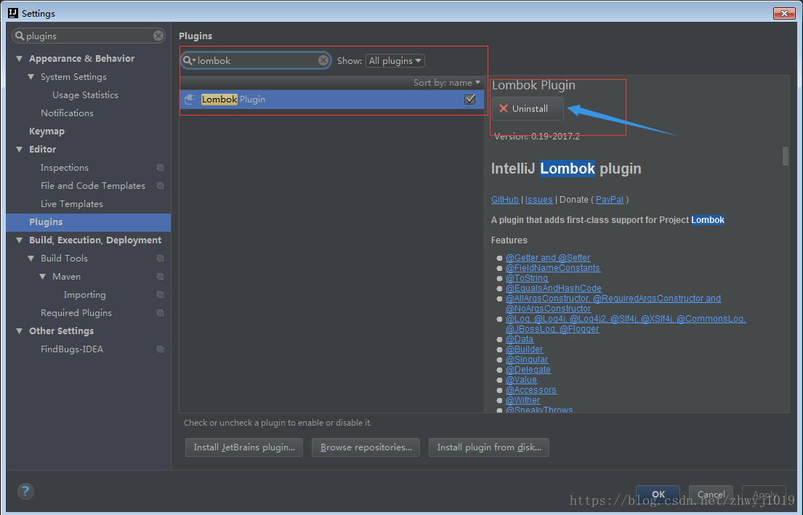
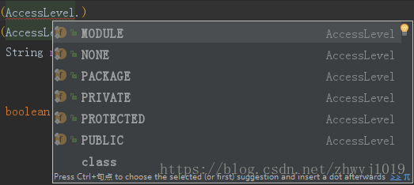
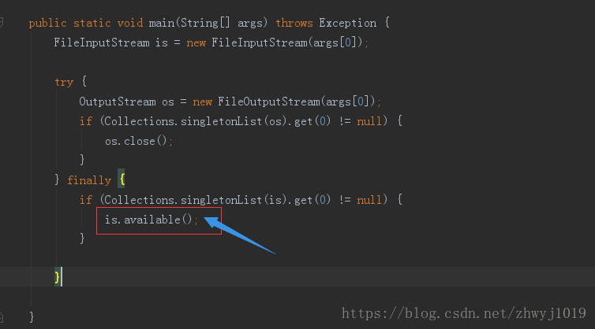
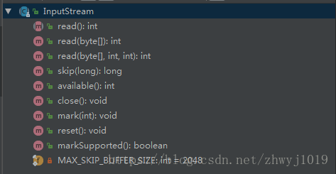

### 相识

lombok想必已经有很多人已经使用了很长时间了，而我却是第一次接触到，有点呆。lombok主要是用于减少重复代码，通过一组简单的注释取代一些重复的Java代码。对于lombok的评价褒贬不一，有的人觉得特别方便，有的人觉得改变了一成不变的代码结构，增加了代码维护成本（有的人没有用过lombok），我是觉得每一个工具诞生肯定是有他诞生的价值的，多学一个是一个啊，小老弟，用不用再说。：）

[官方文档地址](http://jnb.ociweb.com/jnb/jnbJan2010.html)

[官方API地址](https://projectlombok.org/api/lombok/package-summary.html)

[官方注解介绍地址](https://projectlombok.org/features/all)

### 准备

#### 1、下载idea插件

我这里已经安装好了，没有安装的时候按钮应该是Install



#### 2、pom文件引入project lombok的maven依赖

```java
<dependency>
    <groupId>org.projectlombok</groupId>
    <artifactId>lombok</artifactId>
    <version>1.18.2</version>
    <scope>provided</scope>
</dependency>
```

[lombok maven版本](http://mvnrepository.com/artifact/org.projectlombok/lombok)

### 注解介绍

#### @Getter和@Setter

顾名思义，生成get和set方法的注解，@Getter和@Setter发生在编译阶段，编译之后，@Getter和@Setter相关的注解就消失了，取而代之的是相应的get和set方法。

```java
public class LombokTest {
    @Getter @Setter
    private boolean flag;
}
```

lombok遵循了boolean类型的get方法的约定，我们来看一下编译后的代码（等效Java代码）吧。

```java
public class LombokTest {
    private boolean flag;

    public LombokTest() {
    }

    public boolean isFlag() {
        return this.flag;
    }

    public void setFlag(boolean flag) {
        this.flag = flag;
    }
}
```

可以看到boolean类型的get方法是isFlag()而不是getFlag()。我们还可定义生成get和set方法的访问级别。

```java
public class LombokTest {
    @Getter(AccessLevel.PUBLIC)
    @Setter(AccessLevel.PROTECTED)
    private String name;
}
```

编译后的代码（等效Java代码）

```java
public class LombokTest {
    private String name;

    public LombokTest() {
    }

    public String getName() {
        return this.name;
    }

    protected void setName(String name) {
        this.name = name;
    }
}
```

可以看到setName的访问级别是protected。lombok提供了下面几种级别。



AccessLevel枚举类的源代码。

```java
public enum AccessLevel {
    PUBLIC, // public
    MODULE, // 编译后相当于 default
    PROTECTED, // protected
    PACKAGE, // default
    PRIVATE, // private
    NONE; // 不生成

    private AccessLevel() {
    }
}
```

最后@Getter和@Setter注解是可以写在类级别的，作用于所有的成员变量，无法细粒度的控制访问级别。

```java
@Getter(AccessLevel.MODULE)
@Setter(AccessLevel.PROTECTED)
public class LombokTest {
    private String name;
    private boolean flag;
}
```

编译后的代码（等效Java代码）

```java
public class LombokTest {
    private String name;
    private boolean flag;

    public LombokTest() {
    }

    String getName() {
        return this.name;
    }

    boolean isFlag() {
        return this.flag;
    }

    protected void setName(String name) {
        this.name = name;
    }

    protected void setFlag(boolean flag) {
        this.flag = flag;
    }
}
```

#### @NonNull

变量空检查，如果@NonNull注解使用在构造函数的字段时，构造函数也会进行空变量检查。不可用于类级别。

```java
public class LombokTest {
    @NonNull
    @Setter
    @Getter
    private String name;
    
    public LombokTest(@NonNull String name) {
        this.name = name;
    }
}
```

编译后的代码（等效Java代码）

```java
public class LombokTest {
    @NonNull
    private String name;

    public LombokTest(@NonNull String name) {
        if (name == null) {
            throw new NullPointerException("name is marked @NonNull but is null");
        } else {
            this.name = name;
        }
    }

    public void setName(@NonNull String name) {
        if (name == null) {
            throw new NullPointerException("name is marked @NonNull but is null");
        } else {
            this.name = name;
        }
    }

    @NonNull
    public String getName() {
        return this.name;
    }
}
```

#### @ToString

用于生成toString()方法。只能用于类级别。static修饰的变量是不能生成在toString()方法中的，原因是static修饰的变量在类创建的时候就生成了，只有一个；而普通的变量属于对象，每创建一个新的对象都会有一个。可以理解为static修饰的变量属于类，而普通变量数据对象，这样可能好理解一点。

```java
@ToString
public class LombokTest {
    private String name;
    private static String phone;
}
```

编译后的代码（等效Java代码）

```java
public class LombokTest {
    private String name;
    private static String phone;

    public LombokTest() {
    }

    public String toString() {
        return "YmlProperties(name=" + this.name + ")";
    }
}
```

默认情况下出了static修饰的字段都将以name-value的形式生成在toString()方法中。同时toString注解中还可以设置一些属性来细粒度的控制toString()方法。

下面是ToString注解的源码和解释：

```java
@Target({ElementType.TYPE})
@Retention(RetentionPolicy.SOURCE)
public @interface ToString {
    boolean includeFieldNames() default true; // 生成toString()方法时默认为 name-value的形式，设置为false时 则 value的形式。

    String[] exclude() default {}; // 不包含指定字段

    String[] of() default {}; // 包含指定字段

    boolean callSuper() default false; // 是否调用父类的toString()方法

    boolean doNotUseGetters() default false; // 生成toString()方法是否直接访问字段，设置为true时直接访问字段（如：this.name），false时通过getter()方法进行访问(如：this.getName())。当然如果没有生成getter()方法，无论是否设置都直接访问字段

    boolean onlyExplicitlyIncluded() default false; // 是否仅仅包含添加了@ToString.Include的字段，默认为false。

    @Target({ElementType.FIELD})
    @Retention(RetentionPolicy.SOURCE)
    public @interface Exclude { // 使用@ToString.Exclude修饰字段，需要和@ToString注解一起使用，单独使用无效。
    }

    @Target({ElementType.FIELD, ElementType.METHOD})
    @Retention(RetentionPolicy.SOURCE)
    public @interface Include {// 使用@ToString.Include修饰字段，需要和@ToString注解一起使用，单独使用无效。
        int rank() default 0;

        String name() default "";
    }
}
```

**注意：**

* of和exclude属性设置多个字段时，以字符串数组的形式，如：

```java
@ToString(of = {"name","phone"}) // 包含name和phone字段
@ToString(exclude = {"name","phone"}) // 不包含name和phone字段
```

* 使用@ToString.Include或者@ToString.Exclude注解时也需要使用@ToString注解，否者无效。

```java
@ToString
public class LombokTest {
    @ToString.Include
    private String name;
    @ToString.Exclude
    private String phone;
}
```

#### @EqualsAndHashCode

生成equals()和hashCode()方法。默认使用所有的非static和非transient字段生成这两个方法。

```java
@EqualsAndHashCode
public class LombokTest {
    private String name;
    private String phone;
    private boolean flag;
}
```

编译后的代码（等效Java代码）

```java
public class LombokTest {
    private String name;
    private String phone;
    private boolean flag;

    public LombokTest() {
    }

    public boolean equals(Object o) {
        if (o == this) {
            return true;
        } else if (!(o instanceof LombokTest)) {
            return false;
        } else {
            LombokTest other = (LombokTest)o;
            if (!other.canEqual(this)) {
                return false;
            } else {
                label39: {
                    Object this$name = this.name;
                    Object other$name = other.name;
                    if (this$name == null) {
                        if (other$name == null) {
                            break label39;
                        }
                    } else if (this$name.equals(other$name)) {
                        break label39;
                    }

                    return false;
                }

                Object this$phone = this.phone;
                Object other$phone = other.phone;
                if (this$phone == null) {
                    if (other$phone != null) {
                        return false;
                    }
                } else if (!this$phone.equals(other$phone)) {
                    return false;
                }

                if (this.flag != other.flag) {
                    return false;
                } else {
                    return true;
                }
            }
        }
    }

    protected boolean canEqual(Object other) {
        return other instanceof LombokTest;
    }

    public int hashCode() {
        int PRIME = true;
        int result = 1;
        Object $name = this.name;
        int result = result * 59 + ($name == null ? 43 : $name.hashCode());
        Object $phone = this.phone;
        result = result * 59 + ($phone == null ? 43 : $phone.hashCode());
        result = result * 59 + (this.flag ? 79 : 97);
        return result;
    }
}
```

和ToString注解相似也可以通过设置一些属性来控制决堤生成的hashCode()和equals()方法。下面是@EqualsAndHashCode注解的源码和解释，和@ToString一样的属性就没有写注释了。

```java
@Target({ElementType.TYPE})
@Retention(RetentionPolicy.SOURCE)
public @interface EqualsAndHashCode {
    String[] exclude() default {};

    String[] of() default {};

    boolean callSuper() default false;// 是否使用父类的equals和toString方法，注意：父类为Object时无法设置为true。

    boolean doNotUseGetters() default false;

    EqualsAndHashCode.AnyAnnotation[] onParam() default {};

    boolean onlyExplicitlyIncluded() default false;

    /** @deprecated */
    @Deprecated
    @Retention(RetentionPolicy.SOURCE)
    @Target({})
    public @interface AnyAnnotation { // 过时的方法（deprecated）
    }

    @Target({ElementType.FIELD})
    @Retention(RetentionPolicy.SOURCE)
    public @interface Exclude {
    }

    @Target({ElementType.FIELD, ElementType.METHOD})
    @Retention(RetentionPolicy.SOURCE)
    public @interface Include {
        String replaces() default "";
    }
}
```

#### @Data

这是lombok中使用的最多的注解，相当于`@ToString`，`@EqualsAndHashCode`， `@RequiredArgsConstructor`，`@Getter`和`@Setter`五个注解的功能。虽然使用起来方法，但是失去了细粒度的控制。如果需要细粒度控制，则需要进行注解的覆盖。

```java
@Data
public class LombokTest {
    private String name;
    private String phone;
    private boolean flag;
}
```

编译后的代码（等效Java代码）

```java
public class LombokTest {
    private String name;
    private String phone;
    private boolean flag;

    public LombokTest() {
    }

    public String getName() {
        return this.name;
    }

    public String getPhone() {
        return this.phone;
    }

    public boolean isFlag() {
        return this.flag;
    }

    public void setName(String name) {
        this.name = name;
    }

    public void setPhone(String phone) {
        this.phone = phone;
    }

    public void setFlag(boolean flag) {
        this.flag = flag;
    }

    public boolean equals(Object o) {
        if (o == this) {
            return true;
        } else if (!(o instanceof LombokTest)) {
            return false;
        } else {
            LombokTest other = (LombokTest)o;
            if (!other.canEqual(this)) {
                return false;
            } else {
                label39: {
                    Object this$name = this.getName();
                    Object other$name = other.getName();
                    if (this$name == null) {
                        if (other$name == null) {
                            break label39;
                        }
                    } else if (this$name.equals(other$name)) {
                        break label39;
                    }

                    return false;
                }

                Object this$phone = this.getPhone();
                Object other$phone = other.getPhone();
                if (this$phone == null) {
                    if (other$phone != null) {
                        return false;
                    }
                } else if (!this$phone.equals(other$phone)) {
                    return false;
                }

                if (this.isFlag() != other.isFlag()) {
                    return false;
                } else {
                    return true;
                }
            }
        }
    }

    protected boolean canEqual(Object other) {
        return other instanceof LombokTest;
    }

    public int hashCode() {
        int PRIME = true;
        int result = 1;
        Object $name = this.getName();
        int result = result * 59 + ($name == null ? 43 : $name.hashCode());
        Object $phone = this.getPhone();
        result = result * 59 + ($phone == null ? 43 : $phone.hashCode());
        result = result * 59 + (this.isFlag() ? 79 : 97);
        return result;
    }

    public String toString() {
        return "LombokTest(name=" + this.getName() + ", phone=" + this.getPhone() + ", flag=" + this.isFlag() + ")";
    }
}
```

下面看一下@Data注解的源码。

```java
@Target({ElementType.TYPE})
@Retention(RetentionPolicy.SOURCE)
public @interface Data {
    String staticConstructor() default "";
}
```

可以看到提供了一个，staticConstructor(),这个方法的作用是私有化构造器，并生成一个静态的获取实例的方法，这样就可通过类名来获取实例（如：LombokTest.getLombokTest()）

```java
@Data(staticConstructor = "getLombokTest")
```

```java
private LombokTest() {
}

public static LombokTest getLombokTest() {
    return new LombokTest();
}
// ...省略其他代码
```

#### @Cleanup

自动释放资源，主要用于IO流的操作，不需要手动编写释放资源的`try/finally`代码块。

```java
public class LombokTest {
    public static void main(String[] args) throws Exception {
        @Cleanup InputStream is = new FileInputStream(args[0]);
        @Cleanup OutputStream os = new FileOutputStream(args[0]);
    }
}
```

编译后的代码（等效Java代码）

```java
public class LombokTest {
    public static void main(String[] args) throws Exception {
        FileInputStream is = new FileInputStream(args[0]);

        try {
            OutputStream os = new FileOutputStream(args[0]);
            if (Collections.singletonList(os).get(0) != null) {
                os.close();
            }
        } finally {
            if (Collections.singletonList(is).get(0) != null) {
                is.close();
            }
        }
    }
}
```

还是挺方便的。再来看看@Cleanup注解的源代码

```java
@Target({ElementType.LOCAL_VARIABLE})
@Retention(RetentionPolicy.SOURCE)
public @interface Cleanup {
    String value() default "close";
}
```

可以看到默认调用的是close方法，也就是说我们可以设置finally方法体具体调用的流处理方法。如：

```java
public static void main(String[] args) throws Exception {
    @Cleanup(value = "available") InputStream is = new FileInputStream(args[0]);
    @Cleanup OutputStream os = new FileOutputStream(args[0]);
}
```

编译后的代码（等效Java代码）



具体可以指定哪些字段，需要流对象支持哪些方法了。如InputStream：



#### @Synchronized

同步代码块，只能使用在类方法（static）或者对象方法（普通方法）上，synchronized关键字锁住的是this，@Synchronized注解默认使用的锁为$lock,静态的锁为$LOCK，也可以自己指定锁对象，如示例中的：world

```java
public class LombokTest {
    @Synchronized
    public void hello() {

    }

    @Synchronized
    public static void helloWorld() {

    }

    private final Object world = new Object();
    
    @Synchronized("world")
    public void world() {

    }
}
```

编译后的代码（等效Java代码）

```java
public class LombokTest {
    private final Object $lock = new Object[0];
    private static final Object $LOCK = new Object[0];
    private final Object world = new Object();

    public LombokTest() {
    }

    public void hello() {
        Object var1 = this.$lock;
        synchronized(this.$lock) {
            ;
        }
    }

    public static void helloWorld() {
        Object var0 = $LOCK;
        synchronized($LOCK) {
            ;
        }
    }

    public void world() {
        Object var1 = this.world;
        synchronized(this.world) {
            ;
        }
    }
}
```

#### @SneakyThrows

个人觉得没有啥意义，唯一的作用可能就是不用手动捕获异常或者向上抛出，而是通过lombok帮你捕获。。。可以指定捕获的异常类型，默认捕获的是Throwable。

```java
public class LombokTest {
    @SneakyThrows()
    public void testSneakyThrows() {
       throw new IllegalAccessException();
    }

    @SneakyThrows(IllegalAccessException.class)
    public void testSneakyThrows2() {
        throw new IllegalAccessException();
    }
}
```

编译后的代码（等效Java代码）

```java
public class LombokTest {
    public LombokTest() {
    }

    public void testSneakyThrows() {
        try {
            throw new IllegalAccessException();
        } catch (Throwable var2) {
            throw var2;
        }
    }

    public void testSneakyThrows2() {
        try {
            throw new IllegalAccessException();
        } catch (IllegalAccessException var2) {
            throw var2;
        }
    }
}
```

感觉有点呆。。。官方建议在没有深思熟虑之前不要使用这个注解。。。下面是官网上的一句话：

* You can pass any number of exceptions to the `@SneakyThrows` annotation. If you pass no exceptions, you may throw any exception sneakily.

#### @NoArgsConstructor，@ RequiredArgsConstructor，@ AllArgsConstructor

**@NoArgsConstructor** 生成一个无参构造器。

@NoArgsConstructor注解源代码，另外两个注解的源码和这个很类似，就不贴出来了。

```java
@Target({ElementType.TYPE})
@Retention(RetentionPolicy.SOURCE)
public @interface NoArgsConstructor {
    String staticName() default ""; // 如果指定了相应字段，则私有化构造并生成一个静态的获取实例方法。

    NoArgsConstructor.AnyAnnotation[] onConstructor() default {};

    AccessLevel access() default AccessLevel.PUBLIC;

    boolean force() default false;

    /** @deprecated */
    @Deprecated
    @Retention(RetentionPolicy.SOURCE)
    @Target({})
    public @interface AnyAnnotation { // 过时的（deprecated）
    }
}
```

**@ RequiredArgsConstructor** 生成包含必须处理的字段的构造器，如：final修饰（必须初始化）、@NonNull注解修饰的。

```java
@RequiredArgsConstructor
public class LombokTest {
    private String name;
    private String phone;
    private transient boolean flag;
    private final String finalFiled;
    private static int num;
}
```

编译后的代码（等效Java代码）

```java
public class LombokTest {
    private String name;
    private String phone;
    private transient boolean flag;
    private final String finalFiled;
    private static int num;

    public LombokTest(String finalFiled) {
        this.finalFiled = finalFiled;
    }
}
```

**@ AllArgsConstructor** 生成一个全参构造器，除static修饰的字段。@NonNull可以组合使用。

```java
@AllArgsConstructor
public class LombokTest {
    private String name;
    @NonNull
    private String phone;
    private transient boolean flag;
    private final String finalFiled;
    private static int num;
}
```

编译后的代码（等效Java代码）

```java
public class LombokTest {
    private String name;
    @NonNull
    private String phone;
    private transient boolean flag;
    private final String finalFiled;
    private static int num;

    public LombokTest(String name, @NonNull String phone, boolean flag, String finalFiled) {
        if (phone == null) {
            throw new NullPointerException("phone is marked @NonNull but is null");
        } else {
            this.name = name;
            this.phone = phone;
            this.flag = flag;
            this.finalFiled = finalFiled;
        }
    }
}
```

### 小结

学到这里常用的Lombok注解基本上都有了，如果想要根据深入的学习，建议去官网看。官网地址文章开始已经列出来了，加油！！！