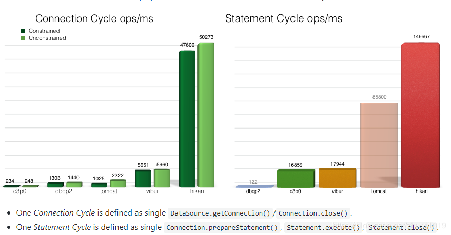

## 简介

SpringBoot2.0 之后使用 HikariCP 连接池更加方便了，因为 SB2.0 之后， HikariCP  连接池代替了 Tomcat 连接池已经成为了 SB2.0 的默认连接池。[Springboot 2.0选择HikariCP作为默认数据库连接池的五大理由](http://blog.didispace.com/Springboot-2-0-HikariCP-default-reason/) ，`springboot `默认依赖中集成了HikariCP,所以不用在引入Hikari的相关依赖了。下面开始正题。



## 环境

- Maven
- JDK 8+
- SpringBoot 2.0.+

## 相关依赖

因为spring boot 2.0使用hikariCP作为默认连接池，所以hikariCP的依赖已经默认集成了，hikariCP的依赖集成在了`spring-boot-starter-jdbc`和`spring-boot-starter-data-jpa`中，我们不需要另外引入hikariCP相关的依赖，这里只是引入了Mysql的依赖和JDBC依赖。

```xml
<dependency>
    <groupId>org.springframework.boot</groupId>
    <artifactId>spring-boot-starter-jdbc</artifactId>
</dependency>
<dependency>
    <groupId>mysql</groupId>
    <artifactId>mysql-connector-java</artifactId>
    <version>8.0.13</version>
</dependency>
```

## 相关配置

```yaml
spring:
  # 数据库连接信息配置
  datasource:
    driver-class-name: com.mysql.jdbc.Driver
    url: jdbc:mysql://127.0.0.1:3306/?useUnicode=true&characterEncoding=UTF-8&autoReconnect=true&useSSL=false&zeroDateTimeBehavior=convertToNull
    username: root
    password: root
    type: com.zaxxer.hikari.HikariDataSource
    # hikari 连接池配置
    hikari:
      minimum-idle: 5 # 最小链接数
      maximum-pool-size: 15 # 最大连接数
      auto-commit: true # 自动提交
      idle-timeout: 30000 # 最大空闲时间（毫秒）
      pool-name: DataPoolHikari # 链接池名
      max-lifetime: 180000 # 最大生命周期（毫秒）
      connection-timeout: 30000 # 连接超时时间（毫秒）
      connection-test-query: SELECT 1 # 心跳检测
```

<center>
    
    <br>
    <div style="color:orange; border-bottom: 1px solid #d9d9d9;
    display: inline-block;
    color: #999;
    padding: 2px;">enjoy coding！</div>
</center>


## 详细配置信息

### 必须配置

| Spring boot配置项 (前缀：spring.datasource.) | 描述              | 默认值 | 对应配置项 |
| -------------------------------------------- | ----------------- | ------ | ---------- |
| url                                          | 数据库url连接信息 | none   | jdbcUrl    |
| username                                     | 用户名            | none   | username   |
| password                                     | 密码              | none   | password   |

### 常用配置

| Spring boot配置项 (前缀：spring.datasource.hikari.) | 描述                                                         | 默认值(ms毫秒，s秒，min分钟)                | 对应配置项          |
| --------------------------------------------------- | ------------------------------------------------------------ | ------------------------------------------- | ------------------- |
| auto-commit                                         | 自动提交从池中返回的连接                                     | true                                        | autoCommit          |
| connection-timeout                                  | 从池中获取连接等待的最大时间，超出时间仍无可用连接，抛出`SQLException` | 30000ms（30s）,最小设置为250毫秒            | connectionTimeout   |
| idle-timeout                                        | 连接在池中空闲的最长时间，`minimumIdle`小于`maximumPoolSize`时有效，值为0时表示始终不删除空闲连接 | 600000ms（10min），最小设置为10000ms（10s） | idleTimeout         |
| max-lifetime                                        | 池中连接的最长生命周期，值0表示没有最大生命周期（无限生命周期） | 1800000ms（30min）                          | maxLifetime         |
| jdbc4-connection-test                               | 如果驱动程序支持JDBC4，强烈建议不要设置此属性                | none                                        | connectionTestQuery |
| minimum-idle                                        | 池中维护的最小空闲连接数，如果池中空闲连接数小于`minimum-idle`，并且小于`maximumPoolSize`，HikariCP会创建新的空闲连接，建议不设置 | 等于`maximumPoolSize`                       | minimumIdle         |
| maximum-pool-size                                   | 池中的最大连接数，包括正在使用和空闲的连接数，建议根据后端数据库进行具体设置 | 10个                                        | maximumPoolSize     |
| metric-registry                                     | 记录各种度量标准                                             | none                                        | metricRegistry      |
| health-check-registry                               | 报告当前的健康信息                                           | none                                        | healthCheckRegistry |
| pool-name                                           | 连接池的名称，主要出现在日志记录和JMX管理控制台中，以标识池和池配置。 | 自动生成                                    | poolName            |

### 不常用配置

| Spring boot配置项 (前缀：spring.datasource.hikari.) | 描述                                                         | 默认值(ms毫秒，s秒，min分钟) | 对应配置项                |
| --------------------------------------------------- | ------------------------------------------------------------ | ---------------------------- | ------------------------- |
| initialization-fail-timeout                         | 如果池无法成功初始化连接，则此属性控制池是否“快速失败”的时间，在此超时发生之前无法获取连接，则将引发异常 | 1ms                          | initializationFailTimeout |
| isolate-internal-queries                            | 确定`HikariCP`是否在其自己的事务中隔离内部池查询，此属性仅在禁用`autoCommit`时适用 | false                        | isolateInternalQueries    |
| allow-pool-suspension                               | 池是否可以通过JMX挂起和恢复                                  | false                        | allowPoolSuspension       |
| read-only                                           | 从池中获取的Connections是否处于只读模式                      | false                        | readOnly                  |
| register-mbeans                                     | 是否注册JMX管理Bean                                          | false                        | registerMbeans            |
| catalog                                             | 设置支持`catalog`概念的数据库的缺省`catalog`。如果未指定此属性，则使用`JDBC`驱动程序定义的缺省`catalog`。 | driver default               | catalog                   |
| connection-init-sql                                 | 设置一个SQL语句,该语句将在每次创建新连接之后，添加到池中之前执行 | none                         | connectionInitSql         |
| driver-class-name                                   | 数据库驱动配置，HikariCP将尝试仅基于jdbcUrl通过DriverManager解析驱动程序，除非您收到明显的错误消息，指出未找到驱动程序，否则请忽略此属性。 | none                         | driverClassName           |
| transaction-isolation                               | 从池返回的连接的默认事务隔离级别。                           | driver default               | transactionIsolation      |
| validation-timeout                                  | 连接将被测试活动的最长时间，最小设置为250ms                  | 5000ms（5s）                 | validationTimeout         |
| leak-detection-threshold                            | 记录消息之前连接可能离开池的时间量，表示可能的连接泄漏,0表示禁止泄漏检测，启用泄漏检测的最低可接受值是2000ms（2秒） | 0                            | leakDetectionThreshold    |
|                                                     | 允许您直接设置要由池包装的`DataSource`实例，而不是让HikariCP通过反射构造它。 | none                         | dataSource                |
| schema                                              | 该属性为支持模式概念的数据库设置默认模式                     | driver default               | schema                    |
|                                                     | 此属性允许您设置将用于创建池使用的所有线程的`java.util.concurrent.ThreadFactory`的实例。 | none                         | threadFactory             |
| scheduled-executor                                  | 此属性允许您设置将用于各种内部计划任务的`java.util.concurrent.ScheduledExecutorService`实例 | none                         | scheduledExecutor         |

## 参考

- https://github.com/brettwooldridge/HikariCP