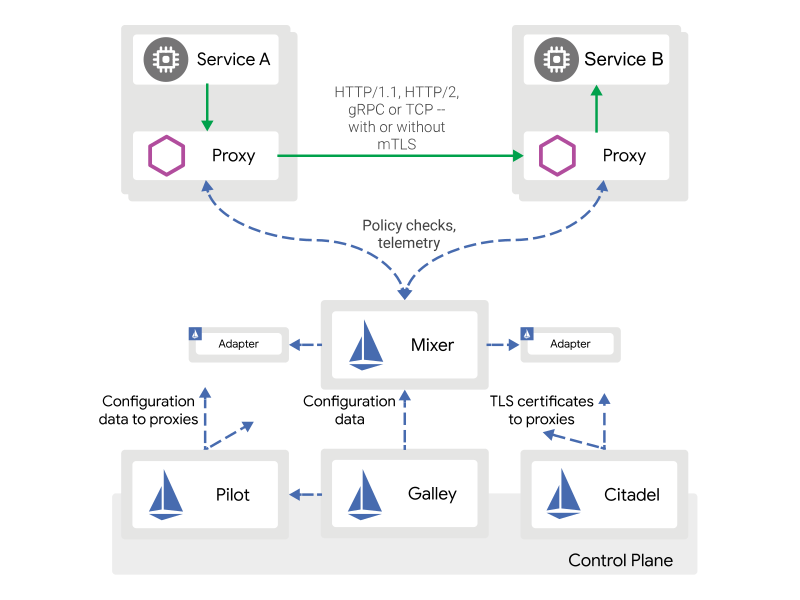

### Istio 核心特性

- 流量管理 （Traffic management）
- 安全管理 （Security）
- 可观测性 （Observability）
- 支持多平台 （Platform support）
- 易于扩展和定制 （Integration and customization）

### Istio 架构

istio的服务网格在逻辑上分为两个部分

- 数据平面（data plane）
- 控制平面（control plane）

#### Envoy

Istio使用 envoy 代理的扩展版本。envoy 是用C++开发的高性能代理，用于对服务网格中所有服务的所有入站和出站通信进行协调。Istio利用了特使的许多内置特性，例如：

- Dynamic service discovery
- Load balancing
- TLS termination
- HTTP/2 and gRPC proxies
- Circuit breakers
- Health checks
- Staged rollouts with %-based traffic split
- Fault injection
- Rich metrics

Envoy 作为一个 sidecar 和相关服务部署在同一个 Kubernetes Pod 中, 通过这种部署方式，Istio可以提取有关流量行为的大量信号作为属性。Istio可以依次在Mixer中使用这些属性来实施策略决策，并将其发送到监视系统以提供有关整个网格行为的信息。Sidecar代理模型还允许您将Istio功能添加到现有部署中，而无需重新构造或重写代码。

#### Mixer

mixer 是一个平台无关的组件，Mixer跨服务网格实施访问控制和使用策略，并从Envoy代理和其他服务收集遥测数据。

#### Pilot

Pilot 提供了Envoy sidecar 的服务发现能力，智能路由的流量管理功能（例如A / B测试，金丝雀推出等）和弹性（超时，重试，断路器等）。

#### Citadel

Citadel通过内置的身份和凭据管理实现了强大的服务到服务和最终用户身份验证。

#### Galley

Galley是Istio的配置验证，提取，处理和分发组件。它负责将其余Istio组件与从底层平台（例如Kubernetes）获取用户配置的细节隔离开来。